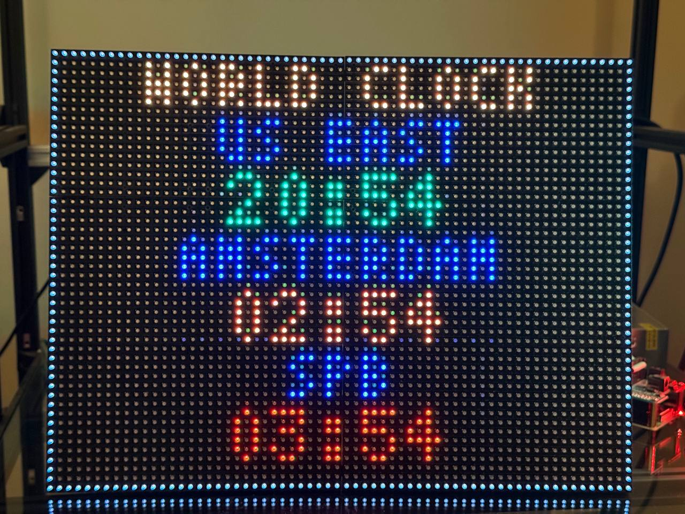
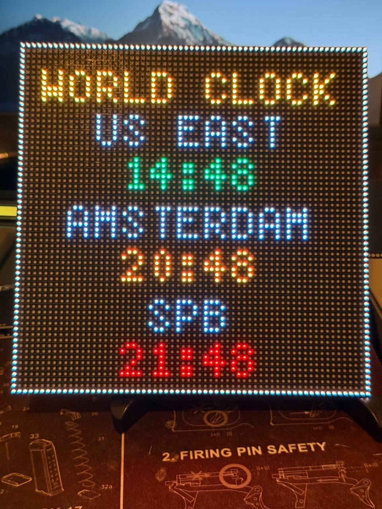
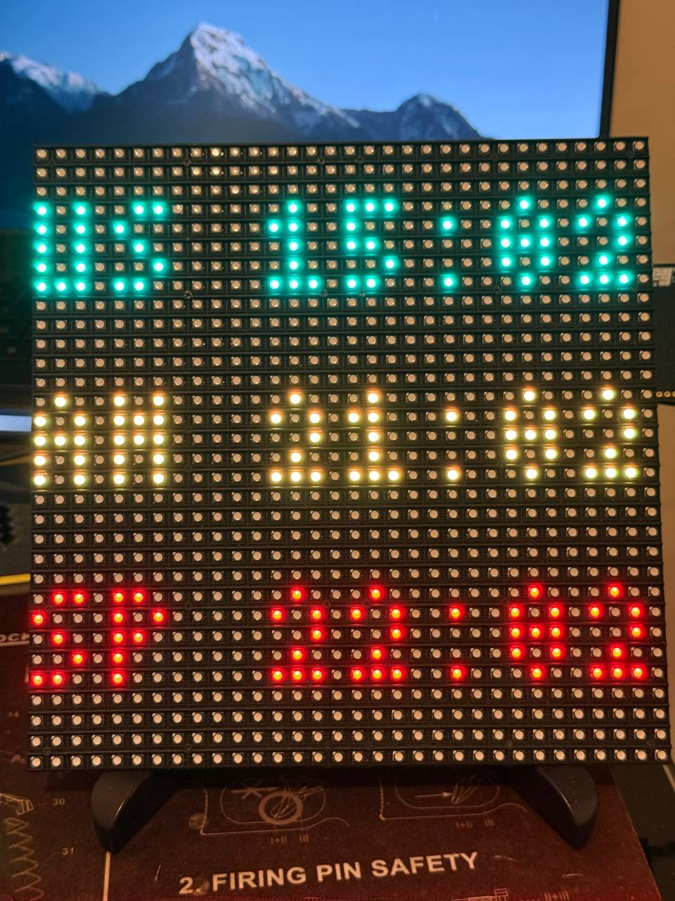

# World Clock (RGB LED Matrix)

A multi-timezone "world clock" for Adafruit MatrixPortal boards and a Raspberry
Pi driving HUB75 RGB LED matrix panels. It shows three time zones at a glance,
each with a colored label and 24-hour time, framed by a thin border.



```
+----------------+
|  WORLD CLOCK   |
|   US EAST      |
|    07:58       |
|  AMSTERDAM     |
|    13:58       |
|    SPB         |
|    14:58       |
+----------------+
```



## Features

- Three configurable time zones, each with its own color.
- **Automatic Daylight Saving Time** for US and EU rules, computed on-device
  (CircuitPython has no timezone database). Zones can also be fixed-offset
  (e.g. Moscow time, which has no DST).
- Time is sourced from **NTP (UTC)** and re-synced hourly; per-zone local time is
  derived by applying each zone's UTC offset, so only one network call is needed.
- Blinking colon, centered labels, and a 1px dimmable border.

## Builds in this repository

- **`64x64-matrixportal-s3/`**, **`32x32-matrixportal-m4/`** — the original
  CircuitPython builds (see the sections below).
- **`rpi4-adafruit-hat/`** — Raspberry Pi 4 + Adafruit RGB Matrix HAT port driving
  six 16×32 panels as a 64×48 canvas. See its
  [README](rpi4-adafruit-hat/README.md) and step-by-step
  [SETUP.md](rpi4-adafruit-hat/SETUP.md).
- **`mqtt-display/`** — an **optional add-on, not part of the world clock.** It's a
  Pi app that displays MQTT messages and falls back to the world clock when idle,
  and it lives here only so it can reuse the Pi build's rendering code. **If you
  just want the clock, ignore this folder** — nothing in the clock depends on it.

## Repository layout

```
World Clock/
├── README.md                     <- this file
├── LICENSE.md                    <- MIT license
├── settings.toml.template        <- copy to settings.toml and fill in
├── secrets.py.template           <- copy to secrets.py and fill in (legacy format)
├── 64x64-matrixportal-s3/        <- 64x64 panel build (MatrixPortal S3)
│   ├── code.py                   <- the clock program
│   ├── 5x7.bdf                   <- bitmap font
│   ├── lib/                      <- CircuitPython libraries (NOT committed; see below)
│   ├── .gitignore
│   ├── settings.toml             <- WiFi credentials (NOT committed)
│   └── secrets.py                <- legacy credentials (NOT committed)
└── 32x32-matrixportal-m4/        <- planned 32x32 panel port (MatrixPortal M4)
```

> Note: `.gitignore` intentionally excludes `settings.toml`, `secrets.py`,
> `boot_out.txt` (which holds the board's MAC address), and the `lib/` folder, so
> credentials, API keys, hardware identifiers, and bundled libraries are never
> pushed to GitHub.

## Hardware (64x64 build)

- Adafruit MatrixPortal S3
- 64x64 HUB75 RGB LED matrix panel (1/32 scan)
- USB-C power supply (a 64x64 panel at full brightness can draw several amps;
  size the supply accordingly)
- Optional: 3D-printed diffuser

### Important: the E address line

A 64x64 panel is 1/32 scan and needs **five** address lines (A–E). The MatrixPortal
shares HUB75 pin 8 between ground and the E line via a **solder jumper on the back
of the board** (labeled `E` with `8`/`16` pad options). You must bridge it
(pin 8 for most 64x64 panels) or the display will appear split into bands.
The code already references `board.MTX_ADDRE`; the jumper provides the physical path.

## Software setup

1. Install **CircuitPython** on the board (developed against CircuitPython 10.2.1
   on the MatrixPortal S3).
2. Copy `code.py`, `5x7.bdf`, and the `lib/` folder to the `CIRCUITPY` drive.
3. Create a `settings.toml` on the drive with your WiFi credentials:

   ```toml
   CIRCUITPY_WIFI_SSID = "your-network"
   CIRCUITPY_WIFI_PASSWORD = "your-password"
   ```

   These are the only keys this program requires (it uses NTP for time, not
   Adafruit IO). `settings.toml` is git-ignored, so it stays off GitHub.

### Required libraries (`lib/`)

The `lib/` folder is **not included in this repository** — CircuitPython libraries
are distributed by Adafruit. Download the
[Adafruit CircuitPython Library Bundle](https://circuitpython.org/libraries)
(matching your CircuitPython major version) and copy these modules into a `lib/`
folder on the `CIRCUITPY` drive:

- `adafruit_bitmap_font`
- `adafruit_display_text`
- `adafruit_connection_manager`
- `adafruit_ntp`

Alternatively, install them with [`circup`](https://github.com/adafruit/circup):

```bash
circup install adafruit_bitmap_font adafruit_display_text adafruit_connection_manager adafruit_ntp
```

All Adafruit CircuitPython libraries are MIT-licensed.

## How it works

- `adafruit_ntp` fetches **UTC** and caches it, re-syncing every hour.
- For each zone, `offset_hours()` returns the UTC offset, adding +1 hour when DST
  is active. DST windows are computed with `us_dst()` / `eu_dst()` using
  Sakamoto's day-of-week algorithm to find the relevant Sundays.
- `time.localtime(utc_epoch + offset*3600)` produces each zone's wall-clock time.

### Configuration knobs (in `code.py`)

| What | Where |
| --- | --- |
| Zones (label, color, offset, DST rule) | `ZONES` tuple |
| Per-zone / title / label / border colors | `*_COLOR` constants |
| Border color/brightness | `BORDER_COLOR` (e.g. `0x303030`) |
| Font | `bitmap_font.load_font("/5x7.bdf")` |
| Vertical layout | title `make_label(..., 8)` and `BLOCK_Y` |
| 12h vs 24h, blink | time format string in `update()`, `BLINK` |

**Label width note:** with the `5x7.bdf` font (5px/char) the usable width inside
the border is ~62px, so labels should be **≤12 characters** (≤11 for comfortable
margins).

## MatrixPortal M4 (32x32) — secondary build

A 32x32 version runs on a spare MatrixPortal M4 (see `32x32-matrixportal-m4/`).
It's a leftover-hardware experiment rather than the main focus, but it's deployed
and working:



> Note: this photo was taken with the `4x6` font; the build was since switched to
> `tom-thumb` for cleaner rendering at this size.

Key differences from the 64x64 S3 version:

- **Panel size:** `base_width = 32`, `base_height = 32`.
- **Address pins:** 1/16 scan — only **four** address lines (no `board.MTX_ADDRE`,
  no E-line jumper).
- **Networking:** the M4 has no native `wifi` (it uses the ESP32 "AirLift"
  co-processor), so it uses `adafruit_matrixportal.network.Network` +
  `network.get_local_time("Etc/UTC")` to set the RTC to UTC, then the same DST math.
  Requires `ADAFRUIT_AIO_USERNAME` / `ADAFRUIT_AIO_KEY` in `settings.toml`.
- **CircuitPython version:** this M4 runs CircuitPython 9.x, so it needs the 9.x
  `.mpy` libraries (the S3's 10.x set is not compatible — `.mpy` bytecode does not
  cross major versions).
- **Layout:** three color-coded rows (`US` / `AM` / `SP` + `HH:MM`) with `tom-thumb`.

See `ROADMAP.md` for the full notes and the planned Raspberry Pi 4 build.

## DST accuracy note

DST transitions are evaluated by date (not the exact 1–2 AM changeover hour), so
on the single changeover day each spring/fall a zone may be off by up to an hour
for part of that day. This is easy to make hour-exact if needed.

## Credits & attribution

This project is based on Adafruit's **Metro Matrix Clock** example:

- Original code: `Metro_Matrix_Clock/code.py` in the
  [Adafruit Learning System Guides](https://github.com/adafruit/Adafruit_Learning_System_Guides/blob/main/Metro_Matrix_Clock/code.py)
- Guide: [Network Connected RGB Matrix Clock](https://learn.adafruit.com/network-connected-metro-rgb-matrix-clock)
- Copyright (c) 2020 John Park for Adafruit Industries
- License: MIT

The original `BLINK`/`DEBUG` flags, colon-blink logic, and label-centering
approach originate from that example. This project adds multi-timezone support,
on-device DST handling, NTP-based UTC sourcing, the bordered three-zone layout,
and the 64x64 / MatrixPortal S3 configuration.

The SPDX MIT attribution header is preserved at the top of `code.py`.

### Font

`5x7.bdf` is from the X11 **"Misc-Fixed"** bitmap font family by Markus Kuhn,
released into the **public domain** ("Public domain font. Share and enjoy.").

### Libraries

CircuitPython libraries are from the **Adafruit CircuitPython Library Bundle**,
each MIT-licensed (see "Required libraries" above for how to obtain them).

## License

The original Adafruit code is MIT-licensed. This project is distributed under the
**MIT License**; see the attribution above. If you publish this repository,
consider adding a top-level `LICENSE` file containing the MIT license text with a
combined copyright line for Adafruit Industries / John Park (original) and
yourself (modifications).
