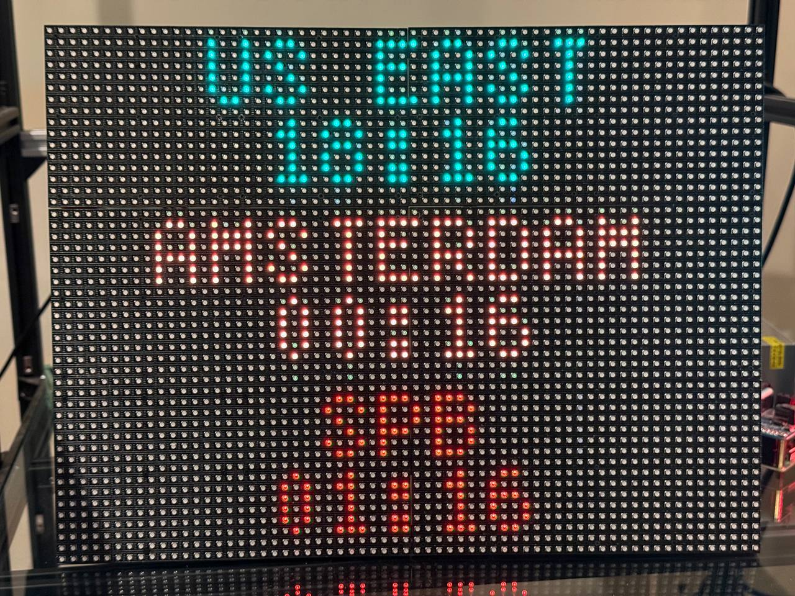
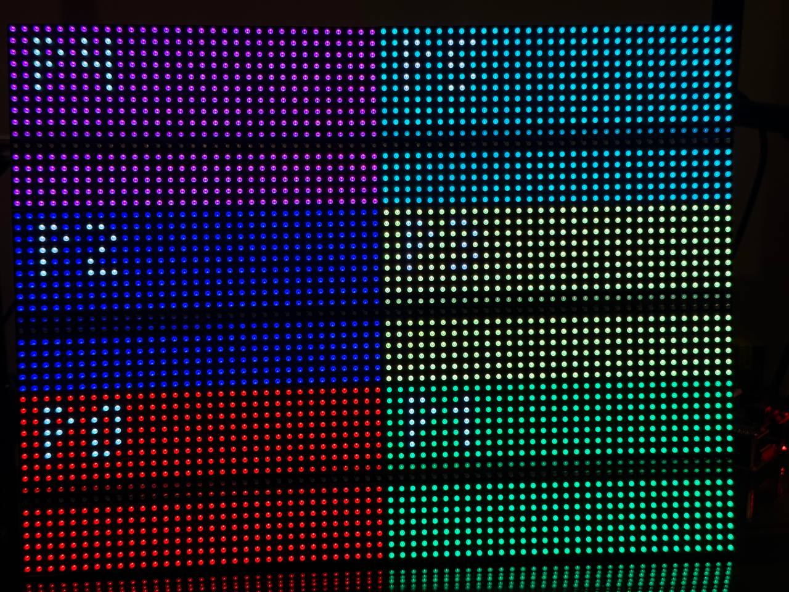
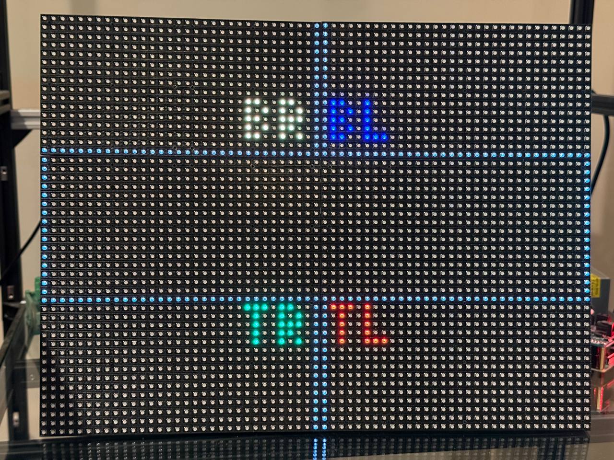

# World Clock — Raspberry Pi 4 + Adafruit RGB Matrix HAT (6 × 16×32)

The Raspberry Pi port of the World Clock. Same three-zone idea as the
CircuitPython builds, but a completely different stack:

| | CircuitPython builds (S3 / M4) | This Pi build |
| --- | --- | --- |
| Driver | `displayio` + `rgbmatrix` + `framebufferio` | hzeller `rpi-rgb-led-matrix` |
| Time | NTP/AIO into the RTC | OS clock (NTP via `systemd-timesyncd`) |
| DST | hand-rolled Sakamoto math | `zoneinfo` (full OS timezone DB) |
| Text | `adafruit_display_text.Label` | Pillow → 64×48 image → serpentine remap |

## Hardware

- Raspberry Pi 4 Model B
- Adafruit RGB Matrix HAT (single chain, one parallel channel)
- 6 × 16×32 HUB75 panels (rows=16, cols=32), arranged **2 wide × 3 tall** → a
  **64×48** logical canvas
- A power supply sized for six panels (size for full-brightness worst case)

## Display layout

A 1px dim-grey **border** frames the canvas, an orange **"WORLD CLOCK" title**
sits at the top, and the three zones follow — each a blue **city label** over a
zone-colored **time** (US EAST green, AMSTERDAM orange, SPB red), with a
blinking colon. This mirrors the 64×64 S3 build, but since the Pi canvas is
only 48px tall, the title and labels use the compact `tom-thumb` font while the
times keep the more legible `5x7` for readability.

```
+----------------+
|  WORLD CLOCK   |
|    US EAST     |
|    18:16       |
|   AMSTERDAM    |
|    00:16       |
|     SPB        |
|    01:16       |
+----------------+
```

Running on the six-panel 64×48 wall:



## Software

The hzeller `rpi-rgb-led-matrix` Python bindings are already installed
system-wide on this Pi (`import rgbmatrix` works). Pillow, `requests`, and
`zoneinfo` are present in the system Python (3.11).

The matrix driver needs GPIO access, so run with `sudo`:

```bash
cd ~/world-clock/rpi4-adafruit-hat
sudo python3 worldclock.py
```

For the cleanest display, blacklist the onboard sound driver (it shares the PWM
the HAT uses) and reboot:

```bash
echo "blacklist snd_bcm2835" | sudo tee /etc/modprobe.d/blacklist-rgb-matrix.conf
sudo reboot
```

`worldclock.py` **auto-detects** `snd_bcm2835`: it uses hardware PWM when the
module is absent (flicker-free) and falls back to software pulsing if it's
loaded, so the clock always starts. On this Pi the module is already blacklisted
**and** `dtparam=audio=off` is set in `/boot/firmware/config.txt`, the CPU
governor is `performance`, and the clock runs flicker-free via hardware PWM. Set
`FORCE_DISABLE_HW_PULSE = True` only if you want to force software pulsing.

## Geometry (confirmed on hardware)

The Adafruit HAT drives all six panels as **one chain**, so the library sees a
raw **192×16 ribbon**. The library's stock pixel-mappers can't express this
panel layout, so instead we render with Pillow to a logical **64×48** image and
remap it to the ribbon ourselves in Python (`remap_to_ribbon()` +
`CELL_TO_CHAIN`). No library mapper, no custom C++ build.

The physical chain order was confirmed with `panel_probe.py` and the photos:

```
top-left  = P4    top-right  = P5
mid-left  = P2    mid-right  = P3
bottom-l. = P0    bottom-r.  = P1
```

i.e. the chain runs bottom row → middle row → top row, left-to-right in each
row, all panels upright (no flips). So `chain = (2 - grid_row) * 2 + grid_col`.

### Gotcha: the chain order is reversed vs. the physical wiring

The physical HUB75 input is the **top-right** panel, so you'd expect chain
position 0 to be top-right. It isn't — the logical chain order comes out
**reversed** (P0 lands bottom-left), so a naive "follow the wiring" mapping
renders scrambled. `panel_probe.py chain` makes this visible by filling each
chain position with a numbered color block:



With the first (intuitive) mapping, the corner test pattern came out wrong —
`BR` showed top-left, `TR` bottom-left, etc. (only the middle row, which happens
to map identity, was correct):



Flipping the cell→chain order (the `(2 - grid_row)` term) fixes it, giving one
continuous, correctly-oriented 64×48 image.

Re-verify any time with the built-in test pattern (one clean 64×48 frame with
labeled corners) or the chain probe:

```bash
sudo python3 worldclock.py test     # TL/TR/BL/BR must land in the right corners
sudo python3 panel_probe.py chain    # 6 colored, numbered blocks
```

## Layout / config knobs (in `worldclock.py`)

| What | Where |
| --- | --- |
| Zones (label, RGB time color, IANA tz) | `ZONES` |
| Title / label / border colors | `TITLE_COLOR`, `LABEL_COLOR`, `BORDER_COLOR` |
| Vertical layout (title + zone tops) | `TITLE_Y`, `ZONE_TOP`, `LABEL_DY`, `TIME_DY` |
| Panel/canvas geometry | `PANEL_ROWS`, `PANEL_COLS`, `CHAIN_LENGTH`, `GRID_ROWS/COLS` |
| Physical panel→chain mapping | `CELL_TO_CHAIN` |
| Brightness / GPIO slowdown | `BRIGHTNESS`, `GPIO_SLOWDOWN` |
| Hardware-pulse override (sound) | `FORCE_DISABLE_HW_PULSE` (auto-detected otherwise) |
| Fonts | `load_bdf("tom-thumb.bdf")` (title/labels), `load_bdf("5x7.bdf")` (times) |
| 12h/24h, blink | time format in `render_clock()`, `BLINK` |

## Credits

Based on Adafruit's Metro Matrix Clock by John Park (MIT). See the top-level
`README.md` and `LICENSE.md` for full attribution.
