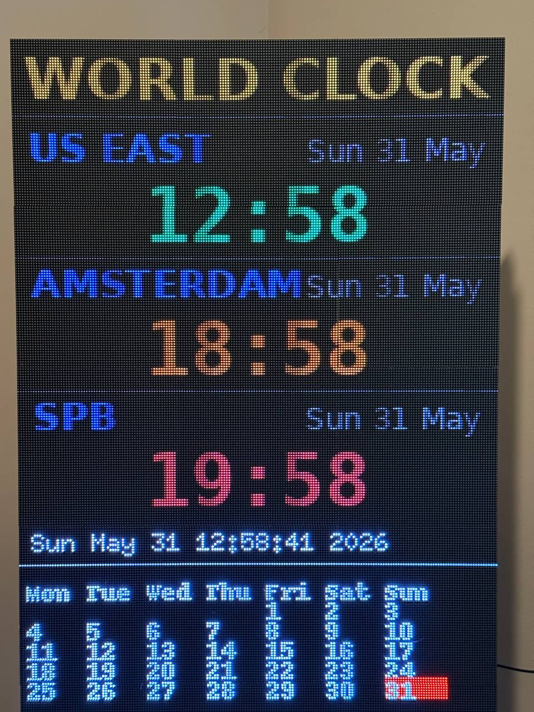
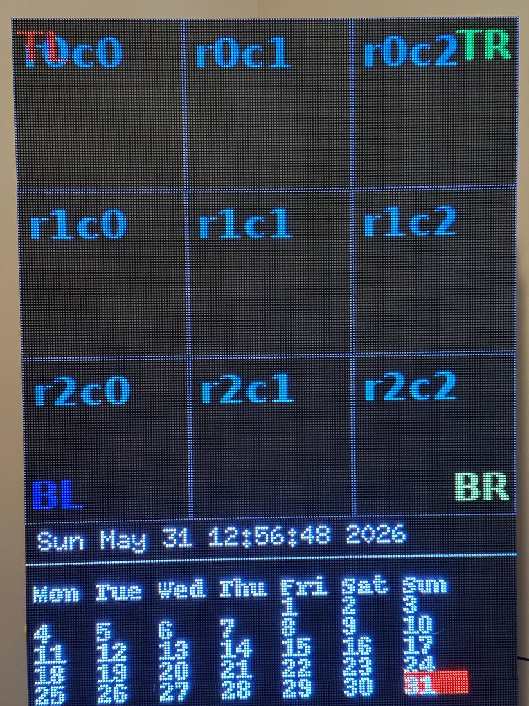

# World Clock — Raspberry Pi 4 + Electrodragon (9 × 64×64)

The big-wall sibling of [`../rpi4-adafruit-hat/`](../rpi4-adafruit-hat/) (the mini
64×48 HAT build). This is the **upper half of the Spectra wall**: one Raspberry Pi 4
driving **nine 64×64 HUB75 panels** via an **Electrodragon** board as a clean
**3×3 grid → 192×192** logical canvas. Same three-zone idea and Pillow→hzeller
stack as the HAT build, but a bigger canvas and a different driver board:

| | HAT build (`rpi4-adafruit-hat`) | This Electrodragon build |
| --- | --- | --- |
| Panels | 6 × 16×32 (2w × 3t) → **64×48** | 9 × 64×64 (3×3) → **192×192** |
| Driver board | Adafruit HAT, single chain | Electrodragon, **3 chains × 3 parallel** |
| `hardware_mapping` | `adafruit-hat` | **`regular`** |
| Geometry | Pillow → serpentine `remap_to_ribbon()` | Pillow → `Rotate:270` mapper, **no remap** |
| Fonts | `tom-thumb` / `5x7` BDF bitmaps | system **DejaVu** TrueType (scales to the big canvas) |
| Time / DST | OS clock (NTP via `systemd-timesyncd`) + `zoneinfo` | same (NTP server on the wall network; **no RTC**) |

## Hardware

- Raspberry Pi 4 Model B
- Electrodragon RGB-matrix driver board (**3 parallel chains**, not the HAT's single chain)
- 9 × 64×64 HUB75 panels (`rows=64, cols=64`), arranged **3 wide × 3 tall** → a
  **192×192** logical canvas (native `cols*chain × rows*parallel` = 192×192; the
  `Rotate:270` mapper keeps it 192×192)
- A dedicated 5 V PSU sized for the wall (connectivity + power validated)

64×64 panels are 1/32 scan (they need the **E** address line); the Electrodragon
board routes it — no HAT-style solder jumper.

## Display layout

An orange **"WORLD CLOCK" title** band sits at the top, then three stacked zones,
each with a blue **city label** + grey **date** over a large monospace
zone-colored **time** (US EAST green, AMSTERDAM orange, SPB red) with a blinking
colon. The big canvas means the times are drawn with a large DejaVu mono TTF for
legibility across the room.

```
+------------------------+
|      WORLD CLOCK       |
| US EAST       Sun 31 May|
|        12:58           |
| AMSTERDAM     Sun 31 May|
|        18:58           |
| SPB           Sun 31 May|
|        19:58           |
+------------------------+
```

Running on the nine-panel 192×192 upper wall:



## Software

The hzeller `rpi-rgb-led-matrix` Python bindings are **not** installed system-wide
on this box (the system `dist-packages` dir is read-only here). Instead we import
the **prebuilt py3.11 build that already drives this wall** via `PYTHONPATH`:

```
/home/kaerka/led-matrix-display/rpi-rgb-led-matrix/bindings/python
```

Pillow and `zoneinfo` are in the system Python (3.11); the times use the system
**DejaVu** TTFs (`/usr/share/fonts/truetype/dejavu`), so no font files are bundled.

The matrix driver mmaps `/dev/mem`, so it must run as **real root**. Use the
wrapper (it sets `PYTHONPATH` for you):

```bash
cd ~/world-clock/rpi4-electrodragon
sudo ./run.sh test     # geometry check (see below)
sudo ./run.sh          # the clock
```

Only **one process can own the matrix GPIO** at a time — stop any other display
program (the weather dashboards, the MQTT app, etc.) first.

### Install as a service (auto-start at boot)

```bash
sudo systemctl enable /home/kaerka/world-clock/rpi4-electrodragon/spectra-clock.service
sudo systemctl daemon-reload
sudo systemctl start spectra-clock
journalctl -u spectra-clock -b      # confirm it came up
```

The unit runs as `root` and sets `PYTHONPATH` to the prebuilt bindings. It
supersedes any other matrix program (they can't share the GPIO).

### Flicker / tuning

This box is already set up for flicker-free output: `snd_bcm2835` is blacklisted
(hardware PWM active), `dtparam=audio=off`, CPU governor `performance`. Driving only
9 panels (the wall used to be one Pi4 on all 18) already roughly doubles the refresh
rate. The one remaining knob is **`isolcpus`** (the driver suggests it at startup):
append ` isolcpus=3` to the single line in `/boot/firmware/cmdline.txt` and reboot to
dedicate core 3 to the refresh thread. Optional further tries: `pwm_bits=10` (from 11)
or `gpio_slowdown=4` (from 5) for higher refresh at minor color/stability cost.

## Geometry (confirmed on hardware)

Unlike the HAT build (one chain → a 192×16 ribbon that needs a Python serpentine
remap), the Electrodragon drives the panels as a clean **3×3 grid**. The library's
`Rotate:270` pixel-mapper handles the orientation, so **no custom `remap` is
needed** — we push the 192×192 Pillow image straight to the canvas. This matches
the known-good config already in use on this wall (the `led-matrix-display` weather
dashboards) and the repo's ROADMAP "Port 3".

The orientation was confirmed with the built-in `test` pattern — a 3×3 grid with
each panel labelled `r{row}c{col}` and the four corners marked:

```bash
sudo ./run.sh test
```

Expect panels to read `r0c0 r0c1 r0c2` (top) … `r2c0 r2c1 r2c2` (bottom), with
corners **TL red (top-left), TR green (top-right), BL blue (bottom-left), BR yellow
(bottom-right)**. Verified correct — no rotation/mirroring:



If the grid ever comes out rotated/mirrored (different board wiring), change
`PIXEL_MAPPER` (`Rotate:90`/`180`/`270`) or add a remap.

## Layout / config knobs (in `spectra_clock.py`)

| What | Where |
| --- | --- |
| Zones (label, RGB time color, IANA tz) | `ZONES` |
| Title / label / date / divider colors | `TITLE_COLOR`, `LABEL_COLOR`, `DATE_COLOR`, `DIVIDER_COLOR` |
| Vertical layout (title + zone blocks) | `TITLE_Y`, `BLOCK_TOP`, `BLOCK_H` |
| Panel/canvas geometry | `PANEL_ROWS`, `PANEL_COLS`, `CHAIN_LENGTH`, `PARALLEL`, `CANVAS_W/H` |
| Pixel mapping / driver board | `PIXEL_MAPPER` (`Rotate:270`), `HARDWARE_MAPPING` (`regular`) |
| Brightness / GPIO slowdown / PWM | `BRIGHTNESS`, `GPIO_SLOWDOWN`, `PWM_BITS`, `PWM_LSB_NS` |
| Fonts (system DejaVu TTF) | `TITLE_FONT`, `LABEL_FONT`, `TIME_FONT`, `DATE_FONT` |
| 12h/24h, blink | time format in `render_clock()`, `BLINK` |

## Files

- `spectra_clock.py` — the clock (192×192 Pillow render → matrix). `test` arg shows
  the 3×3 geometry pattern.
- `spectra-clock.service` — systemd unit (install via the symlink-enable above).
- `run.sh` — `sudo ./run.sh [test]` wrapper that sets `PYTHONPATH`.

> **Roadmap:** this is step one of the Spectra port. The optional MQTT display
> ([`../mqtt-display/`](../mqtt-display/)) also targets this box (`backend: "spectra"`).
> The lower half (`matrixpi-lower`) will run something different. See `../ROADMAP.md`
> Port 3 and `PROJECT_CONTEXT.md` §11.

## Credits

Based on Adafruit's Metro Matrix Clock by John Park (MIT). See the top-level
`README.md` and `LICENSE.md` for full attribution.
